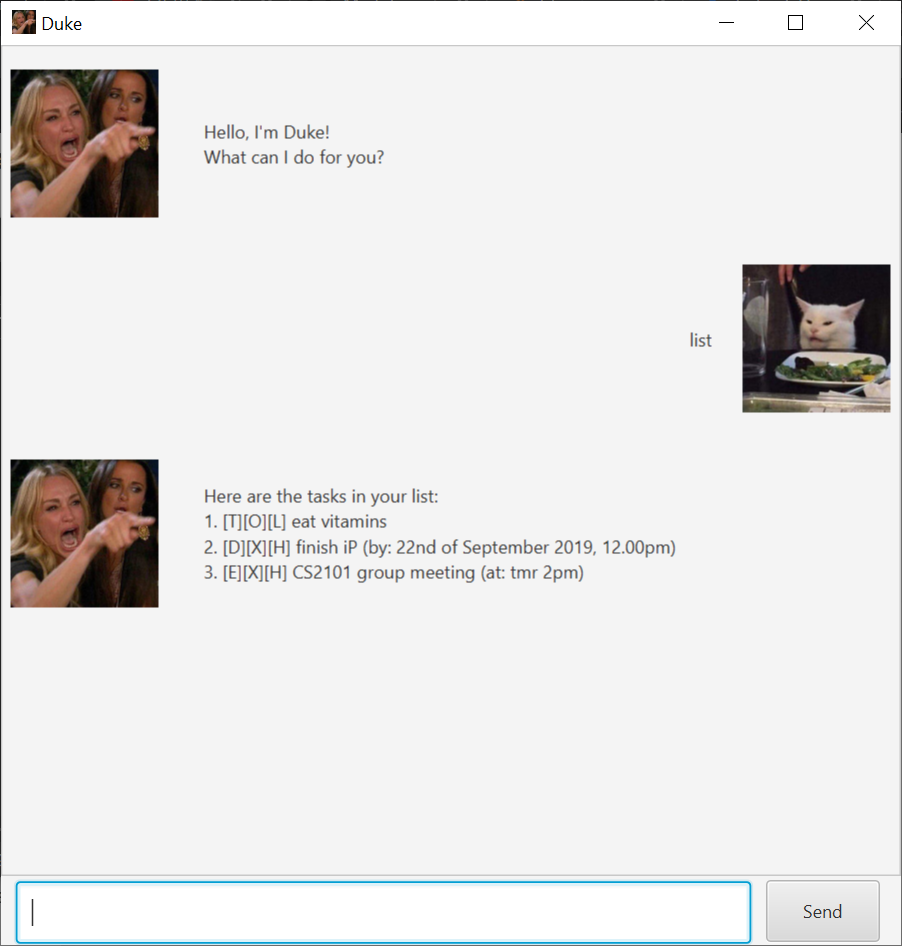
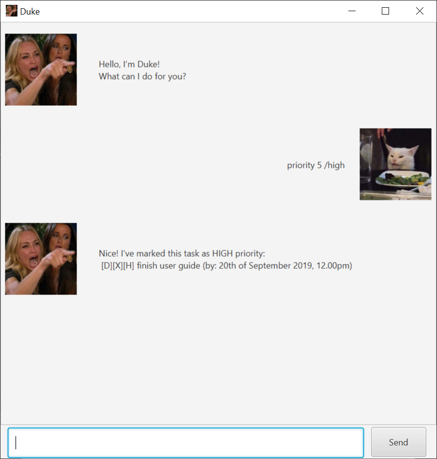
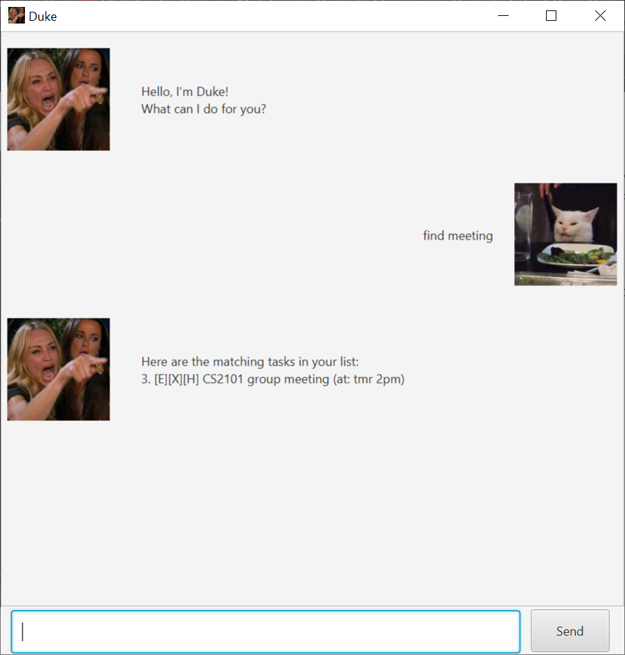
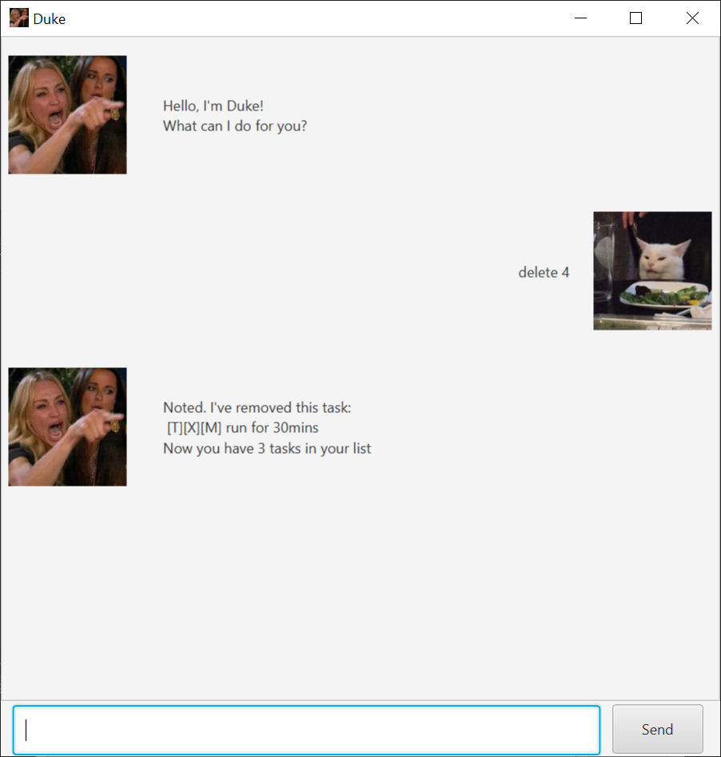
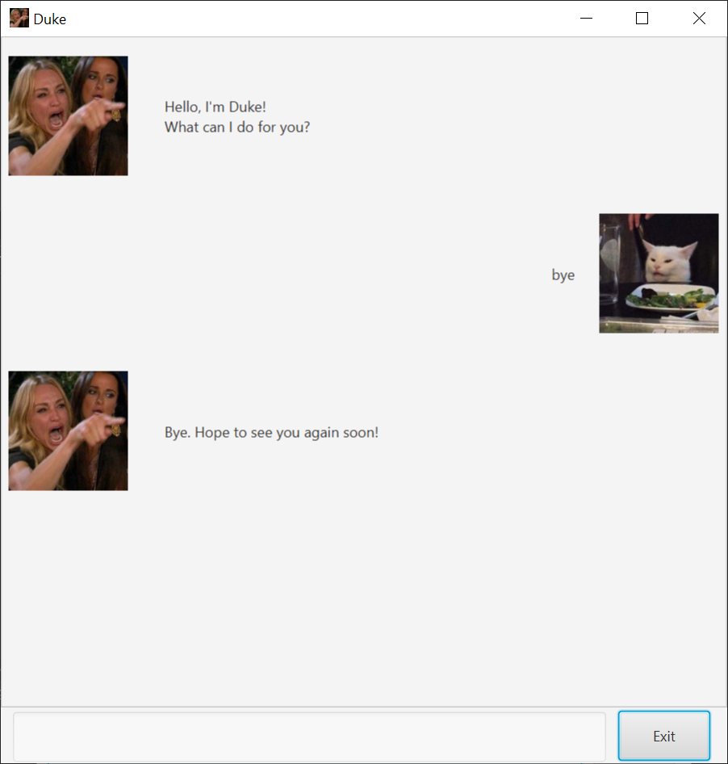

# User Guide
This is a simple user guide for the Duke application that was forked from [nus-cs2103-AY1920S1/duke](https://github.com/nus-cs2103-AY1920S1/duke). Listed below are some of the features and the keywords for the usage of the application.

## Features 

### Feature 1 - Variety of Tasks
In this application, there are three kind of tasks that can be implemented:
1. **todo** - a task that needs to be done but there is no deadline to it
2. **deadline** - a task that needs to be done and there is a deadline to it
3. **event** - a task that has a date in which it is happening

A task is expressed in the form [type][status][priority] description.
The tasks can be differentiated based on the type of the task [X] where X is T/D/E respectively.

### Feature 2 - Mark a task as done
For all the tasks that are in this application, they can be marked as done when they are completed. 
This is to help the user keep track of the tasks that they have and make sure that they are on track with their tasks. 
A task is marked as complete when its status is an O and incomplete when status is a X. By default, when a task is added,
the status is incomplete[X].

### Feature 3 - Priority of a task
For all the tasks that are in this application, they can also have different priority level allocated by the user. 
This is to aid the user in identifying the more urgent tasks so that they are able to prioritise their schedule and do 
the tasks that are of a higher priority first. The priority of a task can be seen from the [priority] part of the task
expression. It is represented by a letter H/M/L to represent high/medium/low respectively. By default, all task when 
added has a priority of medium[M].

### Feature 4 - Smart date
For tasks such as deadline and event, they require a date or time. For this application, a date or time can be passed into
the task in two formats:
1. a string representation of the date (e.g. tmr 1pm, midnight on Monday)
2. a date in the format <DD/MM/YY HHMM>. This will be converted to a format **\<date> of \<month> \<year>, \<time>**.

The two formats will give the user of the application more freedom in terms of choosing how they want to represent
the date. The date will be displayed after the description of the task.

### Feature 5 - Finding a task
The application allows for one to search for a task by their description. This is to help users who have a lot of tasks
on their list and would like to search for a specific task. To allow editting of the task, the index of the task when searched
will be the actual index of the task so that all the other commands will still be able to work on it.

### Feature 6 - Deleting a task
A task can be deleted from the list if it is no longer relevant to the user or there is an error with the task expression. Once
a task is deleted, the index of all the task after it is moved up.

## Usage

### `list` - list all the tasks currently

List all the task that is currently in the list. If there are no tasks in the list, Duke will output that there is no task in the list.

Example of usage: 

`list`

Expected outcome:

```
Here are the tasks in your list:
1. [T][O][L] eat vitamins
2. [D][X][H] finish iP (by: 22nd of September 2019, 12.00pm)
3. [E][X][H] CS2101 group meeting (at: tmr 2pm)
```



### `todo <description>` - add a todo task to the list

Adds a todo task to the list and output the task if it is successfully added.

Example of usage: 

`todo run for 30mins`

Expected outcome:

```
Got it. I've added this task:  
  [T][X][M] run for 30mins 
Now you have # tasks in your list
```


### `deadline <description> /by <date>` - add a deadline task to the list

Adds a deadline task to the list and output the task if it is successfully added. The date can be in the form <DD/MM/YY HHMM>
or it can be a string representation of a date (e.g. tmr 1pm, midnight on Monday).

Example of usage: 

`deadline finish user guide /by 20/09/2019 1200`

Expected outcome:

```
Got it. I've added this task:  
  [D][X][M] finish user guide (by: 20th of September 2019, 12.00pm)
Now you have # tasks in your list
```


### `event <description> /at <date>` - add a event task to the list

Adds a event task to the list and output the task if it is successfully added. The date can be in the form <DD/MM/YY HHMM>
or it can be a string representation of a date (e.g. tmr 1pm, midnight on Monday).

Example of usage: 

`event formal dinner /at tmr 7pm`

Expected outcome:

```
Got it. I've added this task:  
  [E][X][M] formal dinner (at: tmr 7pm)
Now you have # tasks in your list
```


### `done <index>` - mark a task as done

Mark the task at the index as done. To retrieve the index, you can use the list command.

Example of usage: 

`done 4`

Expected outcome:

```
Nice! I've marked this task as done:
  [T][O][M] run for 30mins
```


### `priority <index> /<level>` - change the priority of the task

Change the priority of the task at the index. To retrieve the index, you can use the list command.

Example of usage: 

`priority 5 /high`

Expected outcome:

```
Nice! I've marked this task as HIGH priority:
  [D][X][H] finish user guide (by: 20th of September 2019, 12.00pm)
```



### `find <description>` - find a task

Finds a task based on words within the description.

Example of usage: 

`find meeting`

Expected outcome:

```
Here are the matching tasks in your list:
3. [E][X][H] CS2101 group meeting (at: tmr 2pm)
```



### `delete <index>` - delete a task

Deletes a task based on the index of the task.

Example of usage: 

`delete 4`

Expected outcome:

```
Noted. I've removed this task:
  [T][X][M] run for 30mins
Now you have # tasks in your list.
```



### `bye` - exits the program

Display the bye message of the program. On pressing the exit button or the enter key again, the program exits.

Example of usage: 

`bye`

Expected outcome:

```
Bye. Hope to see you again soon!
```


